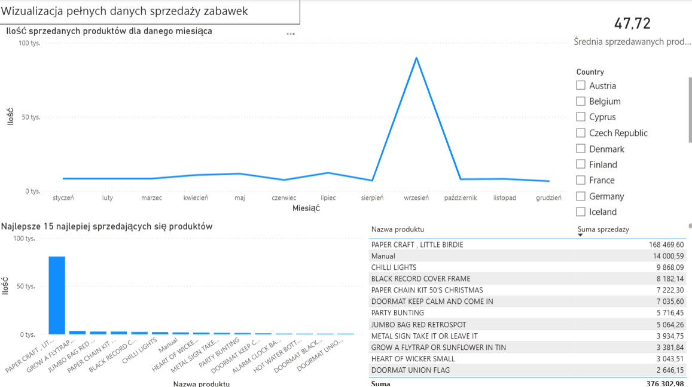
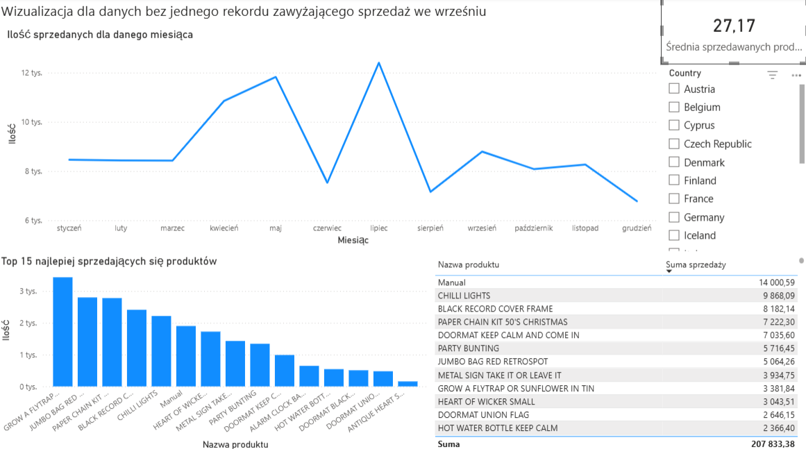

# Analiza zbioru danych dotyczącego sprzedaży zabawek przez internet
Projekt polegający na analizie zbioru danych ecommerce_data_toy_sales, czyli zbioru związanego ze sprzedażą zabawek online. Projekt obejmuje proces czyszczenia danych w języku Python oraz wizualizacji danych w programie PowerBI
## Zbiór danych
Zbiór danych ecommerce_data_toy_sales składał się początkowo z ponad 10000 rekordów. Rekordy składały się z takich danych jak:
- InvoiceNo - numer zamówienia
- StockCode - kod magazynowy
- Description - opis produktu
- Product_id - id produktu
- Quantity - ilość produktu w zamówieniu
- InvoiceDate - data złożenia zamówienia
- UnitPrice - cena za jednostke produktu
- CustomerID - id kupującego
- Country - kraj zakupu
- Shipping - data wysyłki
## Wykorzystane technologie
**Język**: Python
**Wizualizacja**: Power BI
**Środowisko**: VS Code
## Cel
Celem wykonanej analizy było sprawdzenie:
- w których miesiącach było sprzedawane najwięcej produktów
- które produkty najlepiej się sprzedają
- średniej ilości zamawianych produktów w jednym zamówieniu

## Proces czyszczenia
W ramach czyszczenia danych wykonano następujące kroki:
- usunięto rekordy z pustymi danymi oraz duplikaty
- w kolumnie InvoiceNo ujednolicono id do wartości liczbowych całkowitych
- w kolumnie Product_id pozbyto się wierszy z wartościami "missing" oraz zmieniono typ na liczbę całkowitą
- w kolumnie Quantity usunięto dane z wartościami ujemnymi
- w kolumnie Country ujednolicono zapis dla United Kingdom (występowało w jednym czasie "UK" oraz "United Kingdom")
- poprawienie przedstawianej daty w kolumnie ShippingDate

Podczas wizualizacji zauważono, że w zbiorze występuje rekord znacznie odstający od reszty rekordów, więc równocześnie utworzono drugi wyczyszczony zbiór danych bez tego jednego rekordu

## Dashboardy
### Dashboard dla pełnych danych

### Dashboard dla danych bez jednego rekordu (outliera)

## Wnioski
Na podstawie przeprowadzonej analizy można stwierdzić, że w danych występował jeden większy outlier, który sprawiał, że nie można było dostrzec jak zachowuje się reszta danych. Po usunięciu tego outliera można stwierdzić, że najwięcej zabawek kupowanych jest w okresie wiosenno-wakacyjnym, a dokładnie w kwietniu maju jak i lipcu. Dzięki interaktywnemu dashboardowi można zauważyć, że najwięcej klientów pochodzi z Wielkiej Brytanii, a średnia ilość zamawianych produktów jest równa w zaokrągleniu 27 sztukom.

### Pliki
- Czyszczenie.py - skrypt w Pythonie
- Ecommerce_data_toy_sales.xlsx - plik główny z danymi
- Clean_bez_jednego_Ecommerce_data_toy_sales.xlsx - plik z wyczyszczonymi danymi bez outliera
- Clean_Ecommerce_data_toy_sales.xlsx - plik z wyczyszczonymi danymi
- Wizualizacja danych Toy Sales.pbix - plik powerBI z dashboardami